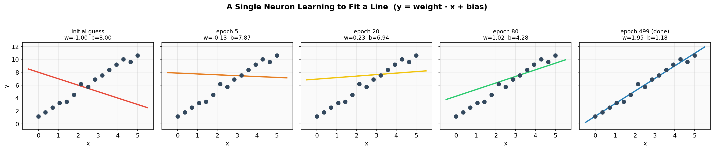
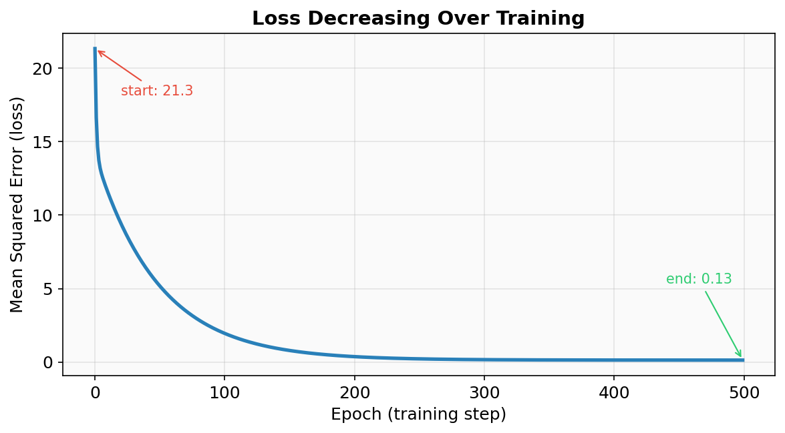
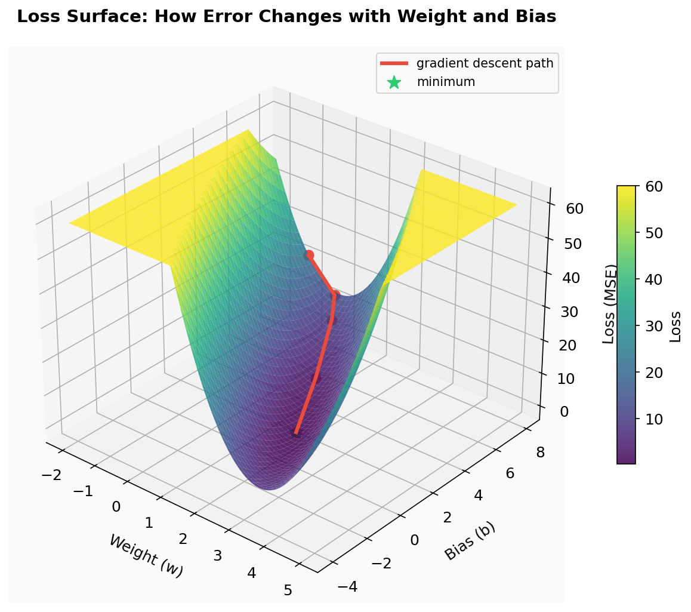
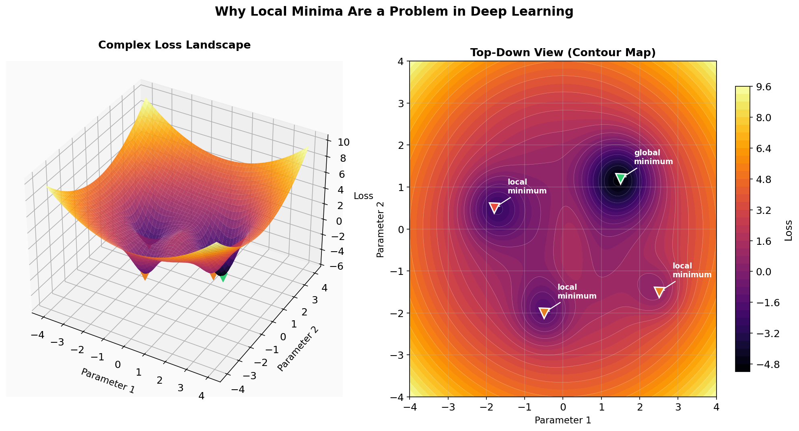
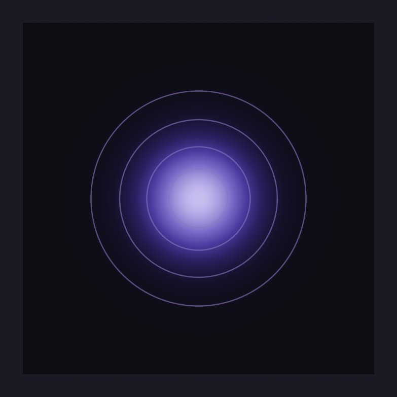
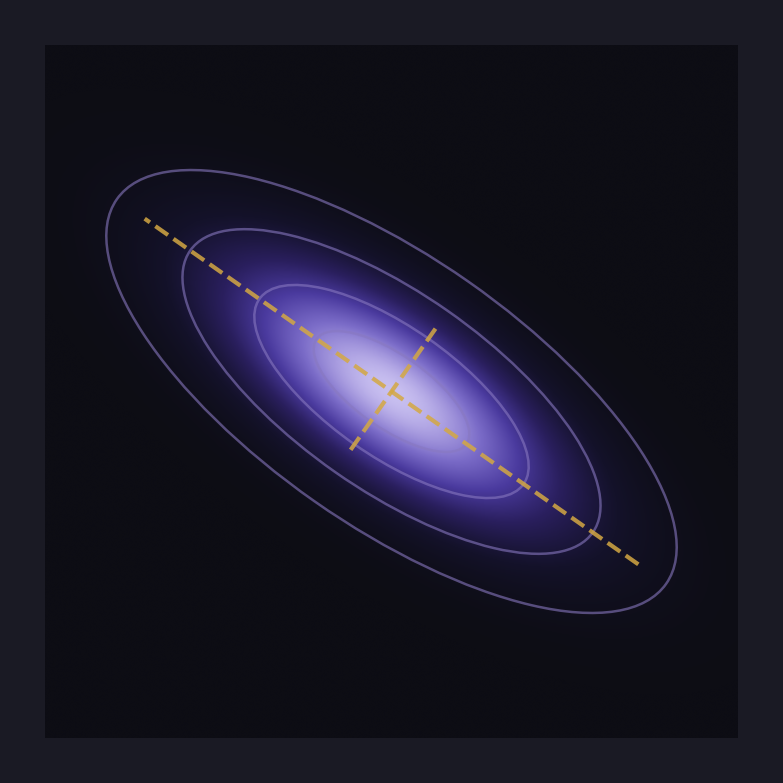
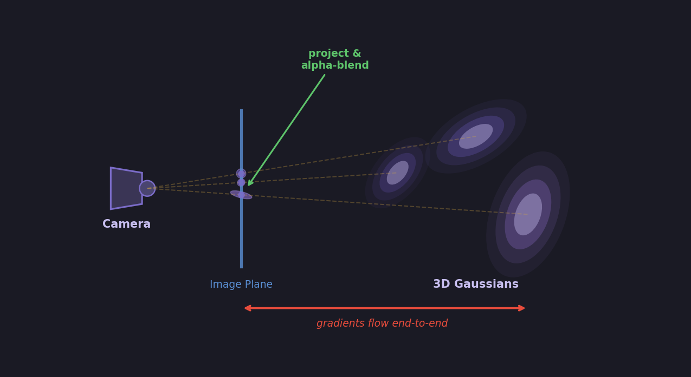

Machine Learning Basics

From Lines to Neurons: Building Intuition from Scratch

---

The Equation of a Line is a Single Neuron

Before diving into neural networks, consider something you already know from school: the equation of a straight line.

```
y = mx + b
```

Where:
- `x` is the input
- `m` is the slope (how steep the line is)
- `b` is the y-intercept (where the line crosses the y-axis)
- `y` is the output

You give it an `x`, it gives you a `y`. That's it.

Now look at how a single neuron in a neural network works:

```
output = weight * input + bias
```

Where:
- `input` is the data you feed in (just like `x`)
- `weight` is a learnable parameter (just like `m`)
- `bias` is another learnable parameter (just like `b`)
- `output` is the result (just like `y`)

These are the same equation. A single neuron without an activation function *is* the equation of a line.

```
y = mx + b
        ↕
output = weight * input + bias
```

---

What Does "Learning" Mean Here?

When you fit a line to data points, you're choosing the `m` and `b` that best describe the relationship in your data. In machine learning, we do exactly the same thing — but we let the computer find the best `weight` and `bias` automatically.

The neuron starts with random (wrong) values for weight and bias. At each step, it checks how far off its predictions are, then nudges the weight and bias slightly in the direction that reduces the error. This process is called **gradient descent**.

Here's what that looks like in practice. The neuron begins with `w=-1.0, b=8.0` — a line sloping the wrong way — and gradually adjusts until it fits the data:



Notice how the weight and bias values change at each step. The line rotates and shifts until it passes through the data points.

The "error" the neuron is minimizing is called the **loss** — specifically, the mean squared error between its predictions and the actual values. Here's how the loss drops over training:



The loss falls steeply at first (big corrections are easy) and then levels off as the neuron fine-tunes its parameters. By the end, the neuron has learned `w=1.95, b=1.18` — very close to the true relationship `y = 2x + 1`.

---

Why Differentiability Matters

The entire equation from input to loss is one continuous mathematical expression. For our single neuron, that equation is:

```
prediction = weight * x + bias

loss = (1/n) * Σ (prediction_i - y_i)²
```

Expanding it fully:

```
loss = (1/n) * Σ ( (weight * x_i + bias) - y_i )²
```

Every part of this — multiplication, addition, subtraction, squaring, averaging — is **differentiable**. That means we can compute the derivative of the loss with respect to `weight` and `bias`:

```
∂loss/∂weight = (2/n) * Σ ( (weight * x_i + bias) - y_i ) * x_i

∂loss/∂bias   = (2/n) * Σ ( (weight * x_i + bias) - y_i )
```

These derivatives tell the neuron exactly which direction to adjust each parameter and by how much. Without differentiability, we'd be searching blindly.

This is the key insight behind all of deep learning: **a neural network is one giant differentiable equation**. No matter how many layers or neurons it has, the entire thing — from raw input to final loss — must form a smooth, differentiable mathematical function. If any piece breaks the chain of differentiability, gradients can't flow back through it, and the network can't learn.

The Loss Surface

To see why this matters, plot the loss for every possible combination of weight and bias. This creates a **loss surface** — a landscape where height represents error:



Each point on this surface is one possible `(weight, bias)` pair and the loss it would produce. The valley at the bottom is the best fit. Gradient descent starts at a high point (our initial bad guess) and follows the slope downhill — the gradient at each point is like a compass pointing toward lower error.

For our simple single neuron, this surface is a smooth bowl with one valley — gradient descent will always find the bottom. But in real neural networks with millions of parameters, the loss surface is a vast, high-dimensional landscape with many valleys, saddle points, and flat plateaus.

Here's what a more complex loss landscape looks like:



The green marker is the **global minimum** — the absolute best solution. The red and orange markers are **local minima** — points that look like the bottom if you only check the immediate neighborhood, but aren't the true best. Gradient descent simply follows the slope downhill from wherever it starts, so it can easily get trapped in a local minimum and never reach the global one.

This is why training deep networks is hard. The landscape has billions of dimensions (one per parameter), and techniques like learning rate schedules, momentum, and optimizers like Adam exist specifically to help navigate past these traps. But the fundamental mechanism — computing gradients on a differentiable function and stepping downhill — remains the same.


---

## Gaussian Splatting: Differentiability Can Learn Anything

Everything above — neurons, loss surfaces, gradient descent — works because the math is differentiable. But a single neuron fitting a line is a toy example. How far can this principle really go?

Gaussian splatting is a striking answer. It uses gradient descent to learn a 3D scene from photographs — not with a neural network, but with thousands of tiny Gaussians that are positioned, stretched, rotated, and colored until they reproduce the original scene. Every parameter is differentiable, so the same "compute loss, take gradient, step downhill" loop applies.

The building block is a **2D Gaussian** — a soft blob of color that fades out from its center:



This is an **isotropic** Gaussian — equal spread in all directions. Its shape is defined by just a center position (μ) and a single variance (σ²). The contour rings show lines of equal density.

But a circle can't represent much on its own. The power comes from allowing each Gaussian to be **stretched and rotated** by giving it a full covariance matrix:



The dashed lines show the principal axes — the directions of maximum and minimum spread. By adjusting the covariance matrix, a single Gaussian can become a thin sliver, a wide disc, or anything in between, oriented at any angle.

Each Gaussian splat has learnable parameters: **position**, **covariance** (shape/orientation), **color**, and **opacity**. Start with thousands of these randomly placed in 3D space, render them onto 2D images, compare against real photographs, compute the loss, and backpropagate. The gradients tell each splat how to move, reshape, recolor, and adjust its transparency — all because every operation in the pipeline is differentiable.

This is the same principle as our single neuron learning `y = 2x + 1`, just scaled up. The equation is more complex, the parameters are more numerous, but the mechanism is identical: **if you can differentiate it, you can learn it**.

### From Photos to 3D: The Pipeline

Gaussian splatting starts with **Structure from Motion (SfM)** — typically a tool like COLMAP. You feed it a set of overlapping photographs of a scene, and it figures out where each camera was positioned and produces a sparse 3D point cloud. This gives you the starting positions for your Gaussians and the camera poses needed to render from.

From there, the training loop is:

1. **Initialize** 3D Gaussians at the SfM point locations with random covariance, color, and opacity
2. **Project** each 3D Gaussian onto the camera's 2D image plane — the 3D covariance transforms through the projection Jacobian to produce a 2D splat
3. **Render** by sorting splats front-to-back and alpha-compositing them into a pixel image
4. **Compare** the rendered image against the real photograph using a loss (L1 + SSIM)
5. **Backpropagate** — gradients flow through the loss, through the alpha-blending, through the projection, all the way back to each Gaussian's position, covariance, color, and opacity
6. **Update** all parameters with gradient descent



The critical point: **every step in this pipeline is differentiable**. The projection is a matrix multiply. The covariance transform uses a Jacobian. Alpha-blending is a weighted sum. The loss is a standard differentiable function. Nothing breaks the gradient chain, so the system can learn to reconstruct an entire 3D scene using the same mechanism our single neuron used to learn `y = 2x + 1` — just with millions of parameters instead of two.

---

## The Transformer: One Giant Differentiable Equation

The same principle scales to the most powerful models in AI today. Look at the Transformer architecture — the engine behind GPT, Claude, and every modern large language model:


This diagram looks complex, but every single block in it is a differentiable mathematical operation:

- **Embedding** — a lookup table (matrix multiply)
- **Positional Encoding** — addition of sine/cosine values
- **Multi-Head Attention** — matrix multiplies and a softmax (differentiable)
- **Add & Norm** — addition and layer normalization (differentiable)
- **Feed Forward** — two linear layers with a ReLU or GELU activation (differentiable)
- **Final Linear + Softmax** — matrix multiply followed by softmax to produce probabilities

From bottom to top, the entire Transformer is one long chain of differentiable operations. Input tokens go in at the bottom, probabilities for the next token come out at the top. The loss compares the predicted probability distribution to the actual next token (cross-entropy loss — also differentiable). Then gradients flow all the way back down through every layer, every attention head, every weight matrix.

A Transformer with billions of parameters is trained the exact same way our single neuron learned `y = 2x + 1`:

```
1. Forward pass:   push input through the equation, get a prediction
2. Compute loss:   how wrong was the prediction?
3. Backward pass:  compute gradients (∂loss/∂every_parameter)
4. Update:         nudge every parameter downhill
5. Repeat
```

The equation is larger — a Transformer might chain together hundreds of matrix multiplies, normalizations, and softmaxes across billions of parameters. But the mechanism is identical. There is no magic. It's calculus, linear algebra, and gradient descent, all the way down.

That's the one idea this entire post comes back to: **if you can write it as a differentiable equation, you can learn it**. A line through data points. A 3D scene from photographs. Human language itself. The math doesn't care what the problem is — only that the chain of derivatives remains unbroken.