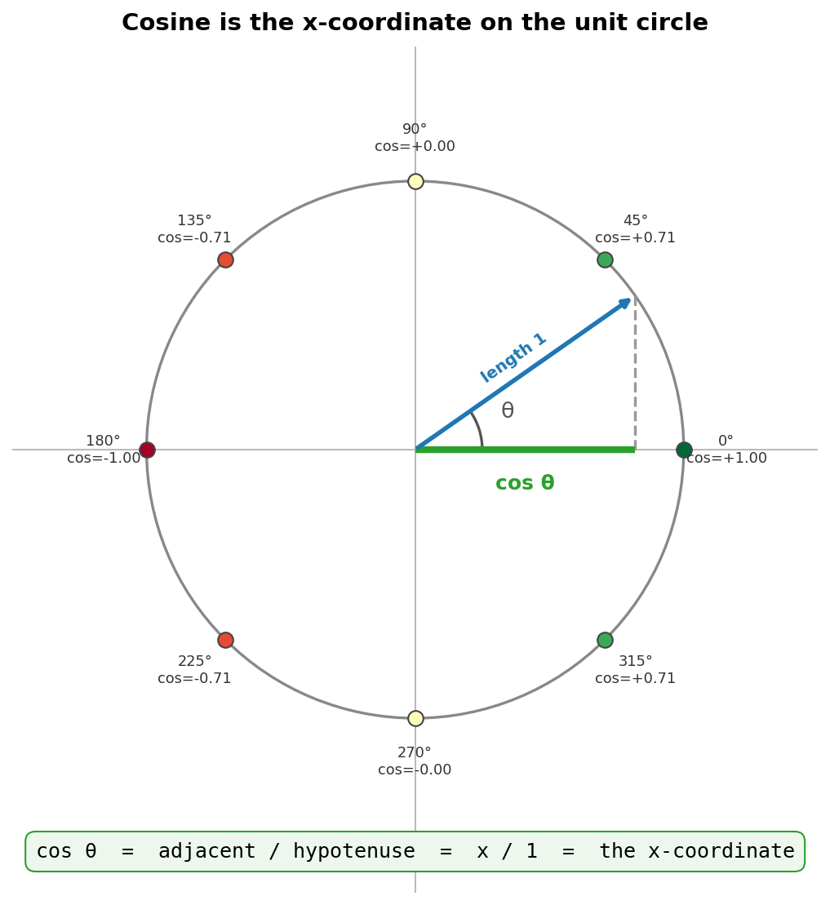
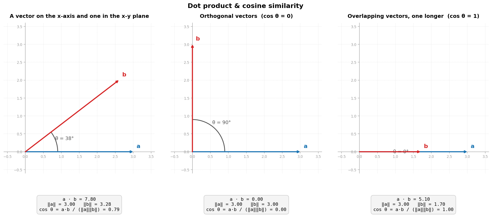
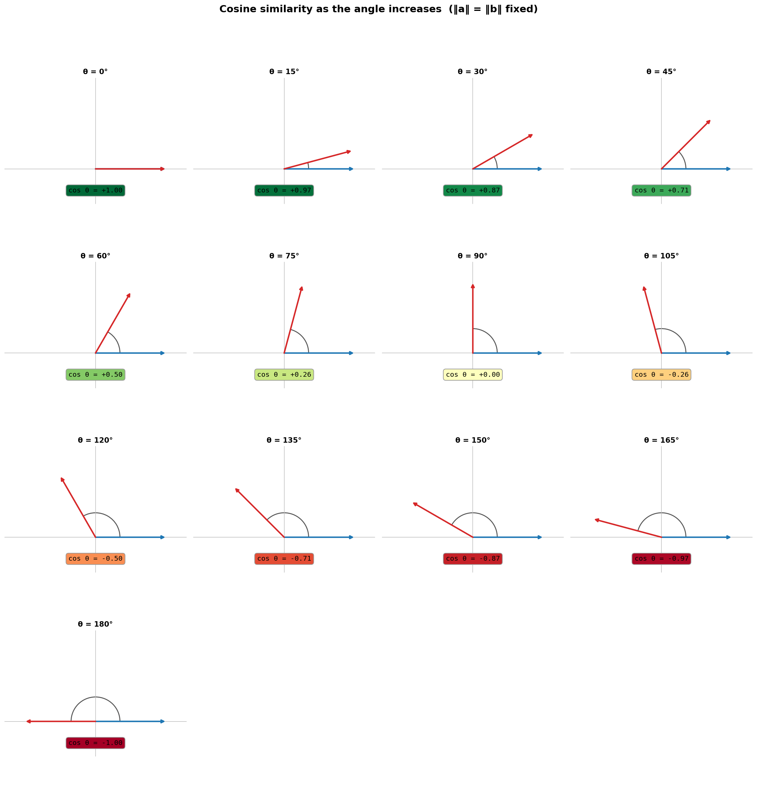
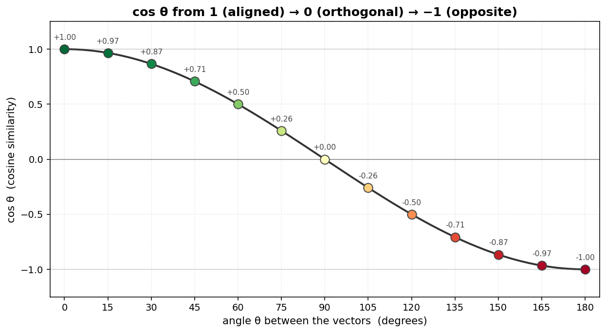
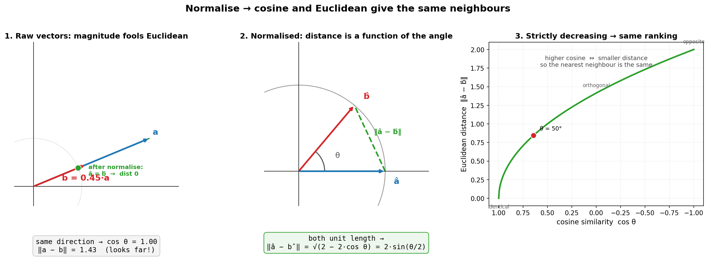
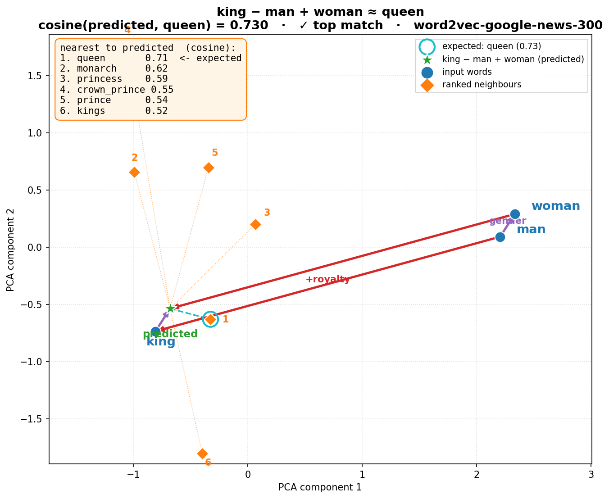
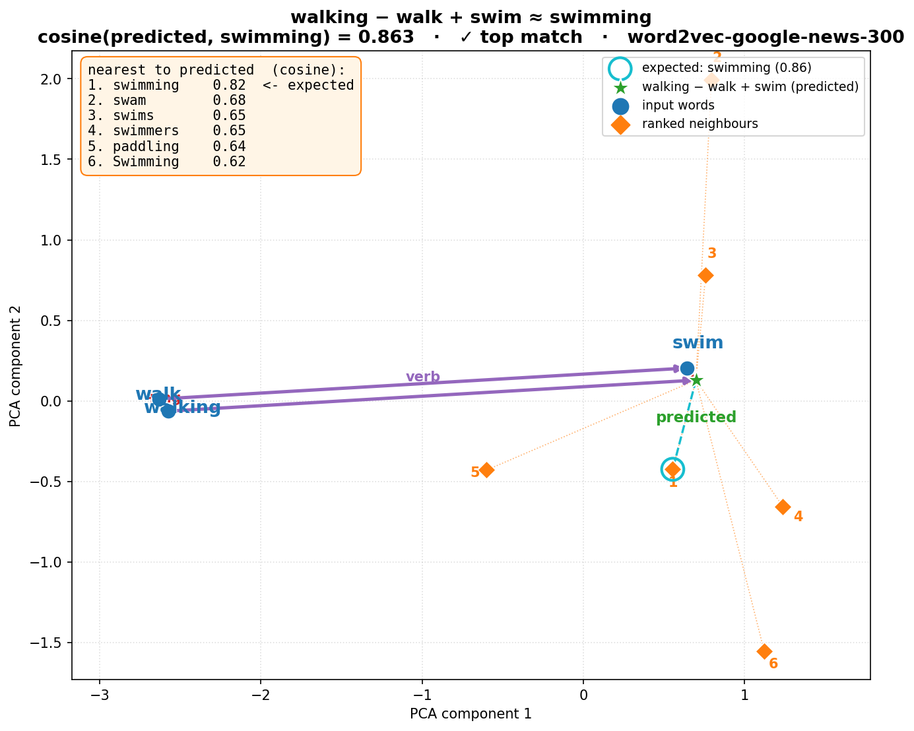
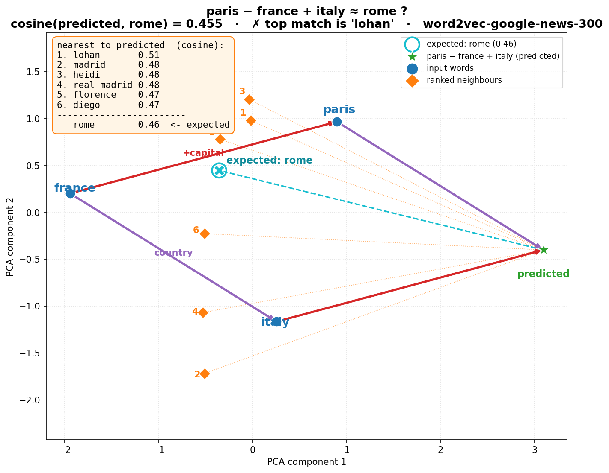
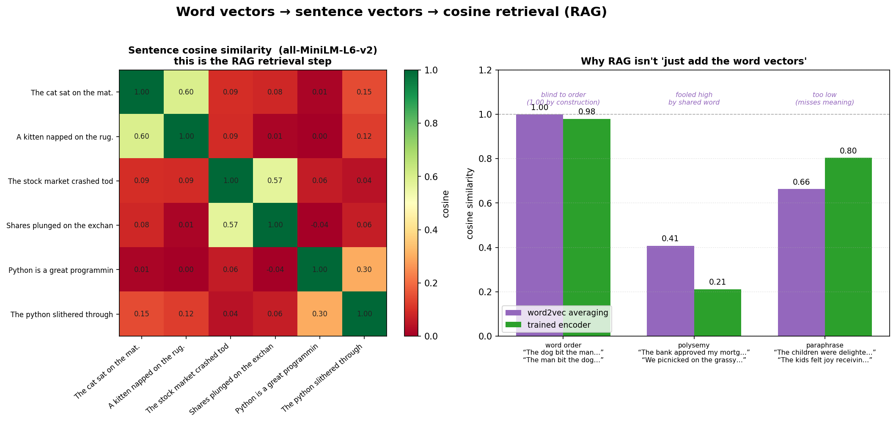

# Cosine similarity: from the unit circle to RAG

One idea — **the cosine of the angle between two vectors** — scales all the way
from high-school trigonometry to how a modern retrieval system decides which
document is relevant to your question. This post climbs that ladder one rung at
a time, each step with a picture you can regenerate.

The thread in one line: **represent things as vectors, then compare them by the
angle between those vectors.**

---

## 1. Cosine starts on the unit circle

Forget vectors for a second. For a point on the unit circle at angle θ, the
**cosine is simply its x-coordinate**. It starts at `+1` (0°, pointing right),
falls through `0` (90°, straight up), to `−1` (180°, pointing left).



That bounded range `[−1, +1]` is the whole reason cosine makes a convenient
similarity score: `+1` = same direction, `0` = perpendicular, `−1` = opposite.

> Script: `sub-scripts/unit_circle_cosine.py`

---

## 2. From an angle to a *similarity*: the dot product

With two vectors **a** and **b**, the angle between them is recovered from the
**dot product**:

```
cos θ  =  (a · b) / (‖a‖ · ‖b‖)
```

Dividing by the lengths cancels magnitude, so cosine measures **direction
only**. Three cases tell the whole story:



- **Aligned** → cos = 1 (and note the *overlapping* case: a long and a short
  vector in the same direction still score 1 — magnitude is ignored).
- **Orthogonal** → cos = 0 (the dot product is literally zero).
- **Opposite** → cos = −1.

> Script: `sub-scripts/dot_product_intro.py`

---

## 3. The full sweep: angle vs. cosine

Hold two unit vectors and rotate one from 0° to 180°. The cosine slides
smoothly and monotonically from `+1` to `−1` — every angle maps to exactly one
similarity.





> Script: `sub-scripts/cosine_spectrum.py`

---

## 4. Why cosine — and when Euclidean is the *same* thing

A fair question: why the angle and not plain straight-line (Euclidean)
distance? The answer: **once vectors are normalised to unit length, the two give
the identical ranking** — `‖a − b‖² = 2 − 2·cos θ`. Cosine is "Euclidean after
you throw away magnitude," and magnitude is usually nuisance (it tracks word
frequency, not meaning).



Full treatment, including why 2-D plots can mislead:
**[cosine-vs-euclidean.md](cosine-vs-euclidean.md)**.

> Script: `sub-scripts/cosine_euclidean_equiv.py`

---

## 5. Words become vectors: analogies

Word embeddings (word2vec) place each word at a point so that **directions carry
meaning**. The famous result `king − man + woman ≈ queen` is just a **cosine
nearest-neighbour** search around the computed point:



It isn't an equation — it's retrieval. "queen" is simply the highest-cosine
neighbour of the point `king − man + woman`. And it doesn't always work:

| Works (morphology) | Works (relation) | Fails (polysemy) |
|---|---|---|
|  |  |  |

`paris − france + italy` *should* give `rome`, but the top neighbour is `lohan`
— the "Paris" vector is contaminated by Paris Hilton. Same arithmetic, same
cosine search; the vocabulary geometry is just off. (The 2-D positions are a PCA
projection — read distances with care; see the Euclidean note above.)

> Script: `sub-scripts/word2vec_analogy.py`

---

## 6. Sentences and documents: RAG

To compare whole *strings*, do the same two things: collapse each to **one
vector**, then take the **cosine**. The naive way is to average the word
vectors — a strong baseline, but blind to word order, fooled by shared words,
and weak on paraphrases. Real systems replace the sum with a **trained encoder**:



The left heatmap **is** the RAG retrieval step: embed sentences, compare by
cosine, pick the nearest. The right panel shows why a trained encoder beats
plain averaging. RAG is then just this at scale:

```
docs → chunks → encoder → vectors → vector DB
query → encoder → vector → cosine nearest neighbours → top-k chunks → LLM answer
```

Full walkthrough: **[rag-intuition.md](rag-intuition.md)**.

> Script: `sub-scripts/rag_intuition.py`

---

## The whole ladder

| Step | The "thing" | Its vector | Compared by |
|---|---|---|---|
| 1 | an angle | a point on the unit circle | cos θ = x-coordinate |
| 2 | two arrows | 2-D coordinates | cos θ = a·b / (‖a‖‖b‖) |
| 4 | (any vectors) | normalised → unit length | cosine = normalised dot product |
| 5 | a **word** | word2vec embedding (300-d) | cosine nearest neighbour |
| 6 | a **sentence / chunk** | trained-encoder embedding | cosine nearest neighbour |

Every rung uses the **same** comparison — the cosine of the angle. What changes
going up the ladder is only **how the thing becomes a vector**: trig → learned
word vectors → a trained text encoder. Master the bottom rung and the top one is
the same move in disguise.

---

## Reproducing every figure

```bash
# pure-matplotlib illustrations (main venv, Python 3.14)
venv/bin/python sub-scripts/unit_circle_cosine.py
venv/bin/python sub-scripts/dot_product_intro.py
venv/bin/python sub-scripts/cosine_spectrum.py
venv/bin/python sub-scripts/cosine_euclidean_equiv.py

# embedding demos (sidecar venv, Python 3.13 — has gensim + sentence-transformers)
venv313/bin/python sub-scripts/word2vec_analogy.py
venv313/bin/python sub-scripts/rag_intuition.py
```

Companion deep-dives: [cosine-vs-euclidean.md](cosine-vs-euclidean.md) ·
[rag-intuition.md](rag-intuition.md)
