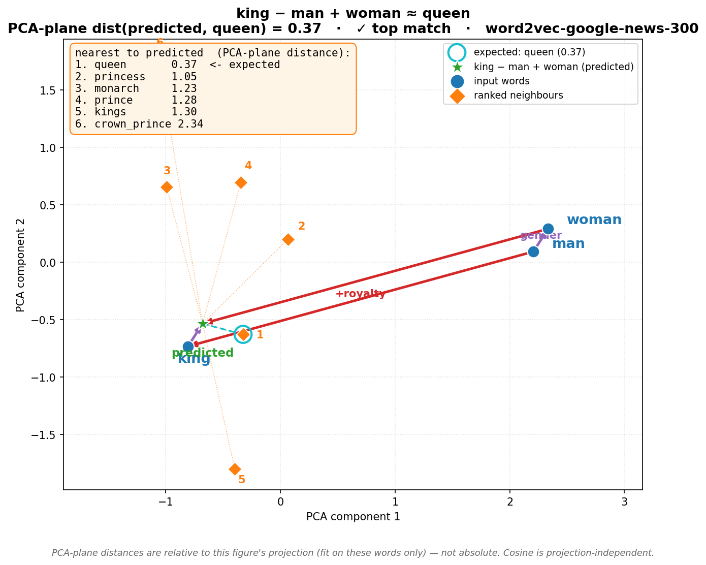
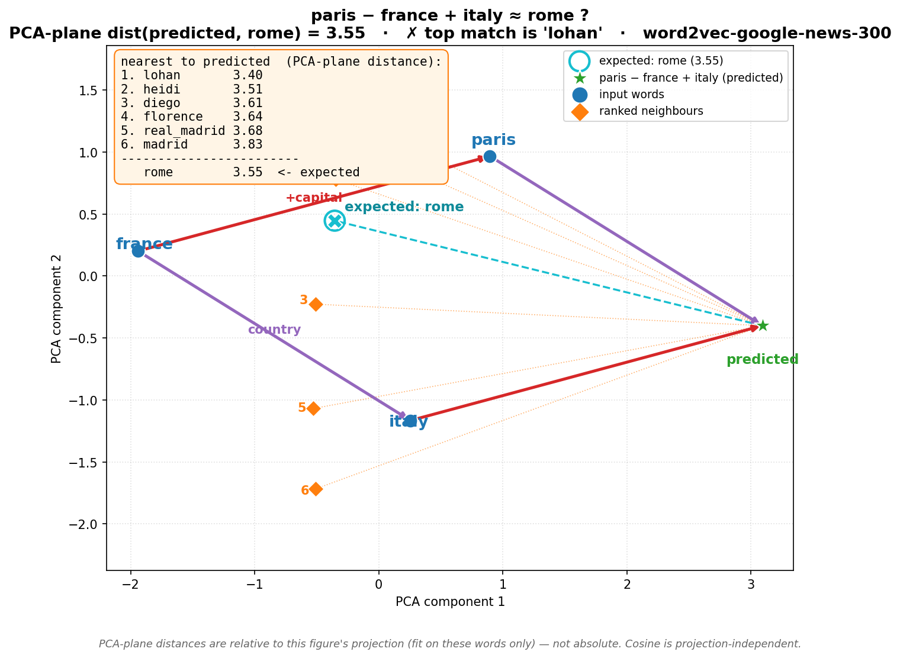

# Cosine vs. Euclidean: what actually decides a word analogy

When you compute `king − man + woman` and get `queen`, it's tempting to read it
as an equation. It isn't. The arithmetic produces a *point* in a 300-dimensional
space, and "queen" is simply the **nearest neighbour** of that point. This note
unpacks which distance metric does the picking — and why the 2-D pictures we
draw can lie about it.

There are **two different spaces** in play, and the answer to "is Euclidean
distance enough?" is different in each.

---

## 1. The original 300-d embedding space — where the answer is decided

This is where `king − man + woman` lives and where the nearest neighbour is
actually chosen. The metric here is **cosine similarity**: the angle between two
vectors, ignoring their length.

The key fact that resolves most of the confusion: **on length-normalised
vectors, cosine and Euclidean produce the *identical* ranking.** The algebra,
for unit vectors (‖a‖ = ‖b‖ = 1):

```
‖a − b‖²  =  ‖a‖² + ‖b‖² − 2(a·b)  =  2 − 2·cos(a, b)
```

So smaller Euclidean distance ⇔ larger cosine — perfectly monotonic. gensim's
`most_similar` L2-normalises every vector first, so its ranking *is* cosine, and
Euclidean-on-normalised-vectors would return the exact same neighbours.
**In that sense, yes — Euclidean is enough, because it is equivalent.**


The catch is the word *normalised*. On **raw** word2vec vectors, magnitudes vary
(they correlate with word frequency and training, not meaning):

- **Cosine** compares only *direction* → "same topic / relation", magnitude ignored.
- **Euclidean** is sensitive to *magnitude* → a frequent word with a long vector
  can look artificially far even when its direction matches.

That is *why the field defaults to cosine*: direction carries the semantics,
magnitude is mostly nuisance. Cosine is "Euclidean after you throw away
magnitude" (panel 1 → panel 2 above).

---

## 2. The 2-D PCA plot — a shadow for your eyes only

The Euclidean distance printed in the `*_euclid.png` plots is measured **in the
2-D projection**, which keeps only 2 of the 300 dimensions (the two
highest-variance directions) and discards the rest. This distance:

- does **not** equal the original-space distance (198 dimensions were dropped), and
- does **not** preserve cosine at all.

That is exactly why the cosine list and the PCA-Euclidean list **rank the
neighbours differently**. In the king example, cosine ranks `monarch` #2 and
`princess` #3; the projected plane flips them. The 2-D number is honest about
*the picture*, but the picture is a lossy cartoon of the real space.

| Decided by cosine (300-d) | Same plot, ranked by PCA-plane distance |
|---|---|
|  |  |

### The vivid example: Paris

`paris − france + italy` *should* give `rome`, but the top match is `lohan`
(the "Paris" vector is contaminated by Paris Hilton). Look at the two numbers
for Rome:

- **Cosine** = 0.46 — barely below `lohan` at 0.51. In the *true* space Rome is
  a near miss (roughly rank 7); the analogy almost works.
- **PCA-plane distance** = 3.55 — way out on the edge of the plot.

If you trusted the picture you'd conclude Rome is wildly wrong. Cosine tells you
it was a close miss. The projection exaggerated the gap.

| Decided by cosine (300-d) | Same plot, ranked by PCA-plane distance |
|---|---|
|  |  |

---

## Bottom line

| Question | Answer |
|---|---|
| What picks the analogy answer? | **Cosine** in the 300-d space (= Euclidean on normalised vectors — same ranking). |
| Is Euclidean enough? | **In the embedding space, yes — if you normalise first** (then it is identical to cosine). On raw vectors, no — use cosine. |
| Is the *plotted* Euclidean enough? | **No.** It reflects only the 2-D projection, not the real space, and ignores cosine entirely — it is there so the legend matches the dots. |

Cosine isn't competing with Euclidean for the actual decision — once you
normalise, they are two views of the same thing. The thing you genuinely
*cannot* substitute is the **2-D plot distance**, which is a projection artifact.

> **Similarity is a property of the high-dimensional space; any 2-D scatter is a
> projection that can lie about it.** Read the figures for intuition, and treat
> the cosine number — not the picture — as the source of truth.

---

## Reproducing the figures

```bash
# analogy plots (needs the py3.13 sidecar venv where gensim is installed)
venv313/bin/python sub-scripts/word2vec_analogy.py

# the cosine-vs-Euclidean equivalence diagram (pure matplotlib)
venv/bin/python sub-scripts/cosine_euclidean_equiv.py
```
